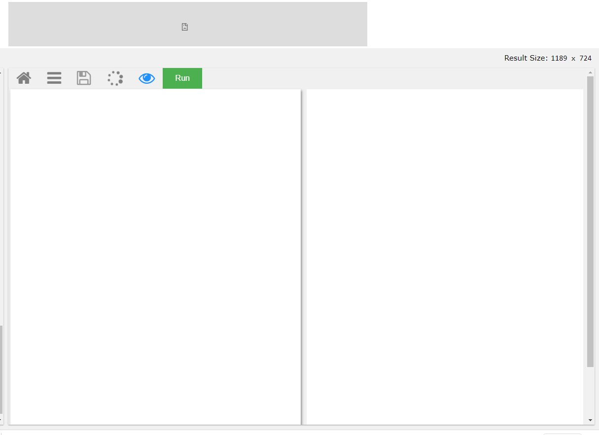
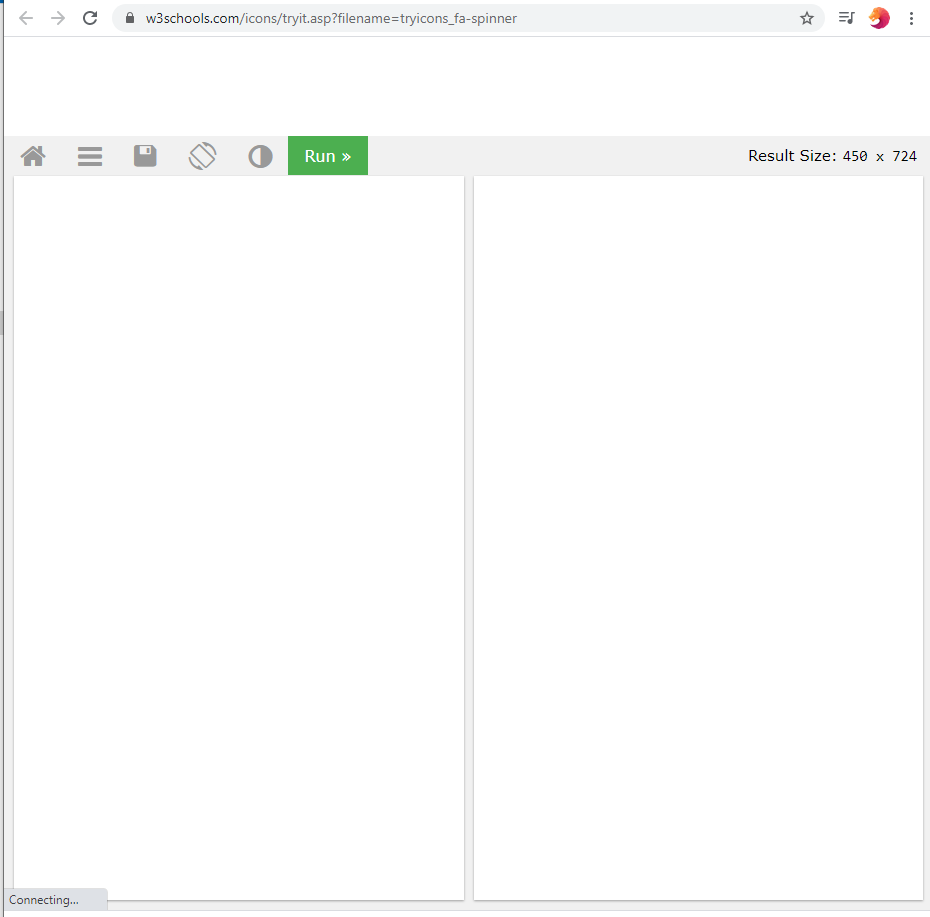
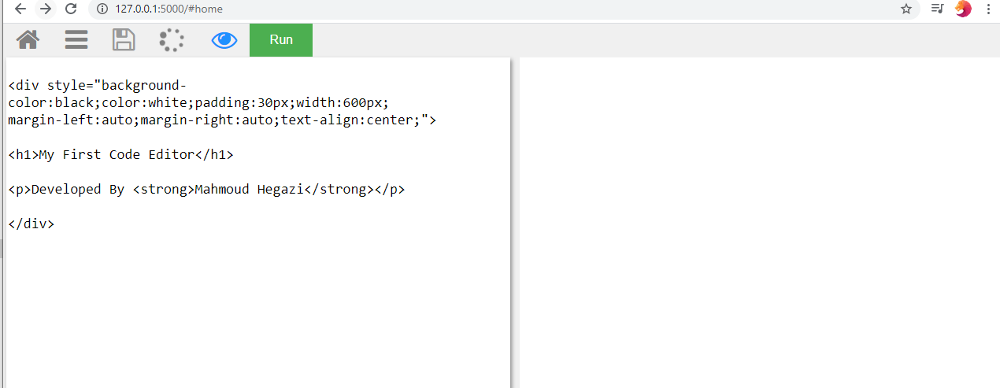
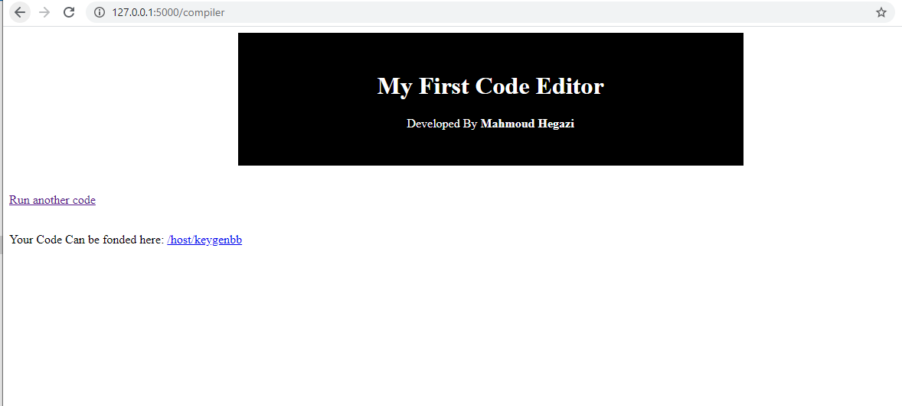
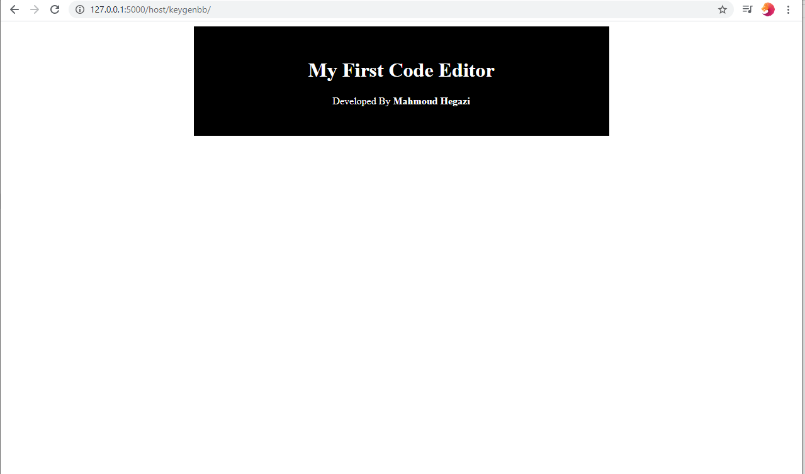
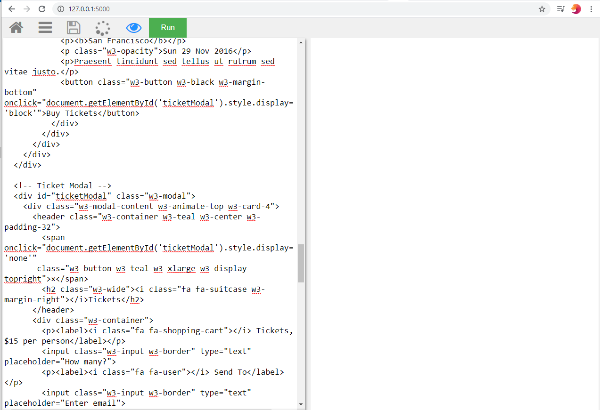
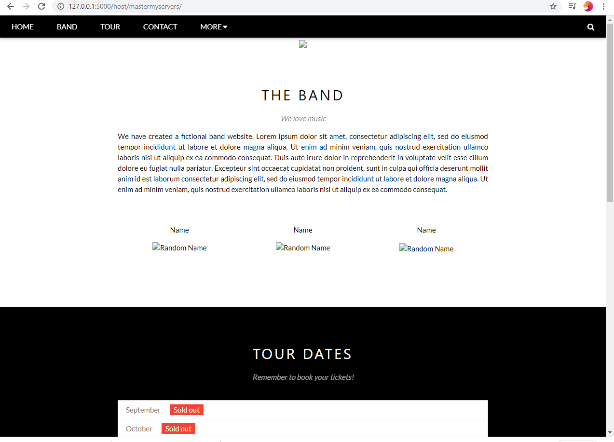

# Code-editor and virtual hosting app

## !before starting Say what is this (read this part):
who In your Team Can build Code editor and host the submited code template and give the user page it's work like htmlpasta.com
this is a restfull API and it use Python function to generate random not reapted fake domain and then
use CRUD (add)(read) to save the sumbited code by user, then I add function with <string var> 
it will accept the last part in the url as string then search the database with CRUD read and 
if the user fakedomain name exist in the database it render template contains the submited
code by user it kinda trick htmp pasta it's like AJAX it's name ends with XML but it can be used with JSON
 so this will used with any front end code the browser can compile it + this function depnd on the browser
  so if it can render the template so you can't even visit the web app url or read this topic right now :D
  read the instractions will help you to understand how to setup the virtual invermont to test the awesome
  restful API lets starting by clone the repo press the creen button 
 
 (I discoverd new trick now you can click back button on browser to edit the code and submit it again until i finish AJAX needed 
 for this point and render the compiled code in the same page)
 
 
 

My editor

w3schools editor

# How it works:

# (How I can Earn from this)
#### (enjoy your template hosted and you can't edit it (But I can so may I take from you money to edit your hosted template !!!!)

+ 1 strange idea : also I can use this to edit others html templates codes by asking them submit your orignal code and write comment or post with what u need or upload images. then You going to recive your code edited after few hours and then pay for the developer.(me for now)

My First code editor, It's not professional but still an editor, it can execute HTML, CSS, bootstrab, javascript, and any other front end languages actually it use the browser so it will act like browser with 0 errors

!! OMG now It's Copy from HTML pasta 

## what you need to use it
*  download and install vagrant and virtual box
*  download gitbash for windows or use terminal on mac or linux
*  clone the project
*  open terminal and cd Downloads create new dir name editor
*  cd editor copy project inside it
*  create dir inside editor and give it name templates
*  add any html page in templates 
*  I added the virtual mahine file needed to stup vagrant don't worry
*  cd now editor run vagrant up then after it finish run vagrant ssh
*  Now cd /vagrant  then cd editor
*  run ls to check files name 
*  run python app.py
*  open browser and write this link 127.0.0.1:5000
*  write your own code html or js or css or any other frontend-langauge 
*  Click run and enjoy With Browser
*  Now you can save and check your Code

### you still think it's noob what about this

